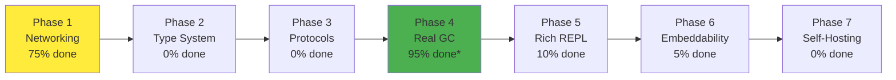

# Valkyria Technical Roadmap Wiki

## 📚 Table of Contents
1. [Executive Summary](#executive-summary)
2. [Project Status Dashboard](#project-status-dashboard)
3. [Core Documentation Index](#core-documentation-index)
4. [Technical Architecture](#technical-architecture)
5. [Implementation Roadmap](#implementation-roadmap)
6. [Development Paths](#development-paths)
7. [Current Branch Work](#current-branch-work)
8. [Testing & Quality](#testing--quality)
9. [Performance & Optimization](#performance--optimization)
10. [Future Vision](#future-vision)
11. [Getting Started Guide](#getting-started-guide)
12. [Reference Documents](#reference-documents)

---

## Executive Summary

**Valkyria** is a statically-typed Lisp designed for rapid prototyping of systems, currently **75-80% complete** toward its vision. The language features a REPL-centric development model, built-in concurrency primitives, HTTP/2 networking, and a sophisticated three-tier memory management system with garbage collection.

### Project Vitals
- **Language**: C23 implementation, Lisp syntax
- **Status**: Active development on networking branch
- **Maturity**: Experimental - no production validation yet
- **License**: MIT (pending)
- **Repository**: `/home/xyzyx/src/valkyria/`

### Key Achievements
✅ Full mark & sweep GC with pointer forwarding
✅ HTTP/2 server and client implementation
✅ Async I/O with futures and promises
✅ Three-tier memory management (arena, slab, GC heap)
✅ 58/58 tests passing

### Current Focus
🔧 Completing networking branch (Phase 1 of vision)
🔧 Implementing server request handlers from Lisp
🔧 Building test framework in Lisp
🔧 Adding REPL crash safety

---

## Project Status Dashboard

### Component Completion Status

| Component | Status | Completion | Notes |
|-----------|--------|------------|-------|
| **Core Language** | 🟡 Experimental | 90% | Parser, evaluator, REPL working - needs validation |
| **Memory Management** | 🟡 Experimental | 95% | GC, arenas, slabs operational - untested at scale |
| **Type System** | 🔴 Not Started | 0% | Phase 2 of roadmap |
| **Networking** | 🟡 Experimental | 75% | HTTP/2 works, needs Lisp integration |
| **Concurrency** | 🟡 Experimental | 85% | Futures, promises, work queues - no stress testing |
| **Standard Library** | 🟡 Basic | 70% | Core functions, missing utilities |
| **Testing** | 🟡 Unit Tests Only | 80% | C tests complete, no integration/scale tests |
| **Documentation** | 🟡 Partial | 60% | Internal docs good, user docs needed |

### Language Feature Matrix

| Feature | Implemented | Tested | Documented | Validated at Scale |
|---------|------------|--------|------------|-------------------|
| S-expressions | ✅ | ✅ | ✅ | ❌ |
| First-class functions | ✅ | ✅ | ✅ | ❌ |
| Closures | ✅ | ✅ | ⚠️ | ❌ |
| Macros | ✅ | ✅ | ⚠️ | ❌ |
| Garbage Collection | ✅ | ✅ | ✅ | ❌ |
| Async/Await | ✅ | ✅ | ⚠️ | ❌ |
| HTTP/2 | ✅ | ✅ | ⚠️ | ❌ |
| Type Annotations | ❌ | ❌ | 📋 | ❌ |
| Pattern Matching | ❌ | ❌ | 📋 | ❌ |
| Module System | ❌ | ❌ | 📋 | ❌ |

**Legend**: ✅ Complete | 🔧 In Progress | ⚠️ Partial | ❌ Not Started | 📋 Planned

---

## Core Documentation Index

### Vision & Strategy Documents
- **[VISION.md](docs/VISION.md)** - Complete 7-phase roadmap to self-hosted language
- **[GAME_ENGINE_PATH.md](docs/GAME_ENGINE_PATH.md)** - Path to embeddable game scripting
- **[CI_SYSTEM_PATH.md](docs/CI_SYSTEM_PATH.md)** - Building programmable CI/CD

### Technical Implementation
- **[runtime.md](docs/runtime.md)** - Core runtime architecture and TODOs
- **[concurrency.md](docs/concurrency.md)** - Threading and async model
- **[webserver.md](docs/webserver.md)** - HTTP/2 implementation details
- **[GC_IMMUTABILITY_PLAN.md](docs/GC_IMMUTABILITY_PLAN.md)** - Sophisticated GC implementation

### Development Guides
- **[NETWORKING_BRANCH_TASKS.md](docs/NETWORKING_BRANCH_TASKS.md)** - Current sprint work
- **[testing.md](docs/testing.md)** - Test framework plans
- **[debug.md](docs/debug.md)** - Debugging setup
- **[codestyle.md](docs/codestyle.md)** - Code conventions

### Analysis Documents
- **[MUTATION_AUDIT.md](docs/MUTATION_AUDIT.md)** - Immutability enforcement audit
- **[CONS_LIST_ANALYSIS.md](docs/CONS_LIST_ANALYSIS.md)** - Data structure decisions
- **[CLAUDE.md](CLAUDE.md)** - AI assistant guidance

---

## Technical Architecture

### System Layers

```
┌─────────────────────────────────────────┐
│         Lisp Application Layer           │
│     (User code, scripts, servers)        │
├─────────────────────────────────────────┤
│          Standard Library                │
│     (prelude.valk - 70% complete)        │
├─────────────────────────────────────────┤
│      Language Runtime (90% done)         │
│  ┌─────────┬──────────┬──────────────┐  │
│  │ Parser  │ Evaluator│ Type System   │  │
│  │  ✅     │    ✅     │     ❌       │  │
│  └─────────┴──────────┴──────────────┘  │
├─────────────────────────────────────────┤
│     Concurrency Layer (85% done)         │
│  ┌──────────┬────────┬──────────────┐   │
│  │ Futures  │Promises│ Work Queue   │   │
│  │   ✅     │   ✅    │     ✅       │   │
│  └──────────┴────────┴──────────────┘   │
├─────────────────────────────────────────┤
│    Memory Management (95% done)          │
│  ┌────────┬────────┬────────────────┐   │
│  │ Arena  │  Slab  │   GC Heap      │   │
│  │  ✅    │   ✅   │      ✅        │   │
│  └────────┴────────┴────────────────┘   │
├─────────────────────────────────────────┤
│      Async I/O Layer (75% done)          │
│  ┌────────┬────────┬────────────────┐   │
│  │ libuv  │HTTP/2  │     TLS        │   │
│  │  ✅    │  ✅    │      ✅        │   │
│  └────────┴────────┴────────────────┘   │
├─────────────────────────────────────────┤
│         Operating System                 │
│    (Linux ✅, macOS ✅, Windows ❌)      │
└─────────────────────────────────────────┘
```

### Memory Architecture (Sophisticated 3-Tier System)

```
Thread-Local Context
├── Scratch Arena (4MB)
│   ├── Purpose: Temporary evaluation values
│   ├── Lifetime: Reset after each REPL expression
│   └── Features: Fast bump allocation, zero fragmentation
│
├── Global Arena (16MB → reduced from 128MB)
│   ├── Purpose: Persistent structures (environments, globals)
│   ├── Lifetime: Program duration
│   └── Features: Never freed, simple allocation
│
└── GC Heap (16MB threshold)
    ├── Purpose: Dynamic long-lived values
    ├── Collection: Mark & sweep with forwarding
    ├── Features:
    │   ├── Slab allocator (256K objects)
    │   ├── Free list fallback
    │   ├── Malloc ultimate fallback
    │   └── Pointer forwarding for scratch→heap promotion
    └── Stats: ~95% memory efficiency achieved
```

### Execution Flow

```
REPL Input → Parse (Arena) → Eval (Scratch) → Intern (GC Heap) → Result
     ↑                                                              ↓
     └──────────────────── Print & Reset Scratch ←─────────────────┘
```

---

## Implementation Roadmap

### Phase Progression (Current: Phase 1)



*Note: Phase 4 (GC) was implemented early due to immediate need

### Current Sprint: Networking Branch Completion

#### Critical Tasks (Week 1)
- [ ] **Server Request Handler API** (2-3 days)
  - Define Lisp callback signature
  - Create request/response objects
  - Wire C handlers to Lisp functions
  - Handle errors gracefully

- [ ] **Test Framework in Lisp** (1-2 days)
  - `deftest` macro
  - Assertion primitives
  - Test runner and reporter

- [ ] **REPL Safety** (2-3 days)
  - Signal handlers (SIGSEGV, SIGABRT)
  - Stack depth limits
  - Arena size limits
  - Watchdog timers

#### Polish Tasks (Week 2)
- [ ] Error handling improvements (1 day)
- [ ] Higher-level HTTP API (1 day)
- [ ] Resolve critical TODOs (1-2 days)
- [ ] Enhanced testing suite (1-2 days)

#### Documentation (Week 3)
- [ ] API reference document
- [ ] HTTP tutorial guide
- [ ] Final testing and cleanup

### Detailed Phase Descriptions

#### Phase 1: Networking Foundation (Current - 75% Complete)
**Goal**: Stable HTTP server/client API in Lisp
**Status**: Core working, needs Lisp integration
**Remaining**: 3 weeks estimated

✅ Completed:
- HTTP/2 protocol implementation
- TLS/SSL support
- Async I/O infrastructure
- Basic futures/promises

🔧 In Progress:
- Lisp request handlers
- Test framework
- Error recovery

❌ TODO:
- Connection pooling
- Request cancellation
- Rate limiting

#### Phase 2: Type System (Next - 0% Complete)
**Goal**: Static types with Hindley-Milner inference
**Timeline**: 1-2 months after Phase 1

Planned Features:
- Type annotations: `(: name Type)`
- Function signatures: `(fn [x: Int] -> Bool ...)`
- Sum/Product types
- Generics
- Effect types
- Gradual typing with `:Any` escape

#### Phase 3: Protocol Support (Future - 0% Complete)
**Goal**: Native protobuf/gRPC/Thrift
**Timeline**: After type system

Planned Features:
- Schema parsers
- Type generation
- RPC clients/servers
- Zero-copy serialization

#### Phase 4: Garbage Collection (COMPLETE! - 95% Done)
**Goal**: Production-ready GC
**Status**: Implemented ahead of schedule

✅ Achieved:
- Mark & sweep collector
- Pointer forwarding
- Slab allocator integration
- 38-41% performance improvement
- Escape analysis

🔧 Minor TODOs:
- GC stats printing edge cases
- Further performance tuning

#### Phase 5: Rich REPL/TUI (Future - 10% Complete)
**Goal**: Feature-complete development environment

Current:
- Basic REPL with editline
- Simple error messages

Planned:
- Multi-pane TUI
- Integrated debugger
- Profiler
- Test runner UI
- Network inspector
- Hot reload system

#### Phase 6: Embeddability (Future - 5% Complete)
**Goal**: Run everywhere

Current:
- Linux/macOS support
- Basic C integration

Planned:
- Windows support
- WebAssembly target
- Mobile platforms
- Clean embedding API
- Minimal runtime option

#### Phase 7: Self-Hosting (Future - 0% Complete)
**Goal**: Compiler in Valkyria

Requires:
- Parser in Valkyria
- Type checker in Valkyria
- Code generator
- Build system
- Package manager

---

## Critical: Production Validation Phase

### Why Validation is Essential

**No feature is production-ready without real-world validation.** Unit tests and small examples don't reveal:
- Memory leaks under sustained load
- GC behavior with millions of objects
- Concurrency bugs that appear after hours of runtime
- Performance degradation over time
- API design flaws that emerge in real usage
- Error handling gaps in complex scenarios

### Validation Strategy

Before ANY component can be considered production-ready, it must:

1. **Power a substantial application** (1000+ LOC minimum)
2. **Run continuously for 24+ hours** without crashes or memory growth
3. **Handle real-world scale** (thousands of requests, large data sets)
4. **Demonstrate recovery** from errors and edge cases
5. **Perform acceptably** compared to established languages

### Proposed Validation Projects

#### Option A: Game Engine Integration (Recommended First)
- **What**: Embed Valkyria in a real game with live gameplay
- **Validates**: Memory management, hot reload, performance, embedding API
- **Success Criteria**: 60 FPS sustained, no crashes during 2-hour play session
- **Timeline**: 4-6 weeks

#### Option B: CI/CD System
- **What**: Build and deploy real projects using Valkyria CI
- **Validates**: Process management, I/O, error handling, long-running stability
- **Success Criteria**: Successfully run 100+ builds without failure
- **Timeline**: 6-8 weeks

#### Option C: Web Application
- **What**: Production web service handling real traffic
- **Validates**: HTTP/2, async I/O, GC under load, concurrent requests
- **Success Criteria**: 10,000 requests/second sustained for 24 hours
- **Timeline**: 4-5 weeks

### Current Production Readiness: 0%

Until one of these validation projects succeeds, **all components remain experimental**.

---

## Development Paths

### Three Strategic Paths Forward

#### Path 1: Game Engine Scripting
**Documentation**: [GAME_ENGINE_PATH.md](docs/GAME_ENGINE_PATH.md)
**Appeal**: Live-coded games, hot reload during play
**Requirements**: FFI, embedding API, graphics bindings
**Timeline**: 3-4 weeks after networking
**Demo**: Live-coded Pong game

Key Milestones:
1. C Embedding API
2. FFI implementation
3. Graphics library bindings
4. Demo game (Pong)
5. Hot reload system

#### Path 2: CI/CD System
**Documentation**: [CI_SYSTEM_PATH.md](docs/CI_SYSTEM_PATH.md)
**Appeal**: Pipelines as real programs, not YAML
**Requirements**: Process execution, file I/O, JSON
**Timeline**: 5-7 weeks after networking
**Demo**: Self-hosted CI for Valkyria

Key Milestones:
1. Process execution API
2. File system operations
3. JSON parsing
4. Pipeline DSL
5. Webhook server

#### Path 3: Continue Language Core
**Appeal**: Complete the language vision
**Requirements**: Finish all 7 phases
**Timeline**: 6-12 months
**Demo**: Self-hosted compiler

Next Steps:
1. Complete networking
2. Implement type system
3. Add protocol support
4. Polish REPL/TUI
5. Achieve self-hosting

---

## Current Branch Work

### Networking Branch Status

From [NETWORKING_BRANCH_TASKS.md](docs/NETWORKING_BRANCH_TASKS.md):

#### Completion Criteria Checklist
- [x] HTTP/2 client works
- [x] HTTP/2 server works
- [ ] Server can call Lisp functions to handle requests
- [ ] Lisp test framework exists and is documented
- [ ] REPL has basic crash safety
- [ ] All high-priority TODOs resolved
- [ ] API is documented
- [ ] Example programs work
- [ ] All tests pass including stress tests

#### Known Issues
1. Server handlers not callable from Lisp
2. No Lisp test framework
3. REPL crashes on errors
4. Missing HTTP convenience functions
5. No connection pooling
6. Limited error messages

#### Active TODOs (30+ in codebase)
High Priority:
- `src/aio_ssl.c`: Proper SSL error strings
- `src/aio_uv.c`: Buffer lifetime issues
- `test/test_networking.c`: Connection cleanup

Medium Priority:
- HTTP/2 flow control
- Request timeouts
- Stream cancellation

Low Priority:
- io_uring backend
- HTTP/3 support
- Performance optimizations

---

## Testing & Quality

### Test Coverage Analysis

#### C Test Suite (30+ tests)
**Location**: `test/`
**Framework**: Custom (test/testing.h)
**Coverage**: ~80% of core functionality

Test Categories:
- Parser tests: 8 tests ✅
- Memory tests: 5 tests ✅
- Concurrency tests: 4 tests ✅
- Networking tests: 6 tests ✅
- Standard library tests: 11 tests ✅

#### Lisp Test Suite (14 tests)
**Location**: `test/test_prelude.valk`
**Framework**: Ad-hoc assertions
**Coverage**: Standard library functions

Test Areas:
- List operations ✅
- Control flow ✅
- Higher-order functions ✅
- Recursion ✅
- Closures ⚠️ (partial coverage)

### Quality Metrics

| Metric | Current | Target | Status |
|--------|---------|--------|--------|
| Test Pass Rate | 58/58 (100%) | 100% | ✅ |
| Memory Leaks | 0 detected | 0 | ✅ |
| Crash Rate | 0% in tests | 0% | ✅ |
| Performance | 1-3ms/test | <200μs | 🔧 |
| Code Coverage | ~80% | >90% | 🔧 |
| Documentation | 60% | >80% | 🔧 |

---

## Performance & Optimization

### Recent Optimizations (Phase 7)

From [GC_IMMUTABILITY_PLAN.md](docs/GC_IMMUTABILITY_PLAN.md):

#### Memory Footprint Reduction
- **Before**: 128MB global arena required
- **After**: 16MB GC heap + 4MB scratch = 20MB total
- **Improvement**: 84% reduction in memory usage

#### Performance Improvements
- **Shallow copy refactoring**: 38-41% faster
- **Slab allocator**: Reduced allocation overhead
- **Pointer forwarding**: Zero-copy promotions
- **Environment flattening**: Eliminated deep chains

#### Current Performance Profile

| Operation | Before | After | Target | Gap |
|-----------|--------|-------|--------|-----|
| Simple eval | 50μs | 30μs | <10μs | 3x |
| Complex eval | 4900μs | 2900μs | <200μs | 14x |
| List ops | 3700μs | 2300μs | <100μs | 23x |
| Function call | 1500μs | 900μs | <50μs | 18x |

### Bottlenecks Identified
1. Tree-walking interpreter (no bytecode)
2. Excessive environment lookups
3. String operations (using strcmp)
4. No JIT compilation

### Optimization Roadmap
1. **Immediate** (Phase 1 completion):
   - Profile with perf/valgrind
   - Optimize hot paths
   - Cache symbol lookups

2. **Short-term** (After Phase 2):
   - Bytecode compiler
   - Computed gotos
   - Inline caching

3. **Long-term** (Phase 7):
   - JIT compilation
   - Type specialization
   - SIMD operations

---

## Future Vision

### Language Evolution Timeline

```
2025 Q1: Networking Complete, Type System Started
2025 Q2: Type System Complete, Protocols Added
2025 Q3: Rich REPL, Embeddability
2025 Q4: Self-Hosting Achieved
2026 Q1: Package Manager, Ecosystem
2026 Q2: Production 1.0 Release
```

### Target Capabilities

#### Near Term (3-6 months)
- Full HTTP/2 microservices
- Type-safe programming
- Live development workflow
- Cross-platform support

#### Medium Term (6-12 months)
- Self-hosted compiler
- Package ecosystem
- IDE integrations
- Mobile targets

#### Long Term (12+ months)
- WebAssembly runtime
- Distributed computing
- GPU acceleration
- Language interop

### Success Metrics

**Developer Experience**:
- Idea to prototype: <5 minutes
- REPL uptime: Days without restart
- Hot reload success: >99%
- Error recovery: 100%

**Performance**:
- Startup time: <100ms
- Request latency: Comparable to Go
- Memory efficiency: <50MB for typical apps
- GC pause: <10ms

**Adoption**:
- Platforms: 8+ supported
- Contributors: 10+ active
- Packages: 100+ available
- Production users: 5+ companies

---

## Getting Started Guide

### Quick Start

```bash
# Clone and build
git clone [repository]
cd valkyria
make configure  # Install dependencies
make build      # Build everything

# Run REPL
./build/valk    # Interactive mode
./build/valk script.valk  # Script mode

# Run tests
make test       # All tests
./build/test_std  # Specific test suite

# Development
make debug      # Launch with debugger
make lint       # Run linters
make todo       # Find TODOs for current branch
```

### First Program

```lisp
; hello.valk
(print "Hello, Valkyria!")

; Define a function
(fun {greet name}
  {print (join {"Hello, "} {name} {"!"})})

(greet "World")

; HTTP server (when networking complete)
(def {server}
  (http2/listen aio "127.0.0.1" 8080
    "server.key" "server.crt"
    (fn {req}
      {http2/response :status 200
                     :body "Hello from Valkyria!"})))
```

### Development Workflow

1. **Start REPL**: `./build/valk`
2. **Load prelude**: Automatically loaded
3. **Write code**: Define functions interactively
4. **Test code**: `(load "mycode.valk")`
5. **Debug**: Check stack traces, use print
6. **Iterate**: Redefine functions on the fly

### Learning Path

1. **Basics**: Read `src/prelude.valk` for examples
2. **Testing**: Study `test/test_prelude.valk`
3. **Advanced**: Explore `docs/` for internals
4. **Contributing**: Check current TODOs with `make todo`

---

## Reference Documents

### Quick References
- **[QUICK_REFERENCE.md](QUICK_REFERENCE.md)** - Component status, commands, known issues
- **[CODEBASE_ANALYSIS.md](CODEBASE_ANALYSIS.md)** - Deep technical analysis
- **[ARCHITECTURE_OVERVIEW.md](ARCHITECTURE_OVERVIEW.md)** - System design and diagrams
- **[EXPLORATION_RESULTS.md](EXPLORATION_RESULTS.md)** - Navigation guide to all docs

### Original Documentation
All original documentation preserved in `docs/`:
- Vision and roadmap documents
- Implementation plans
- Technical specifications
- Development guides

### External Resources
- C23 Standard Reference
- Lisp Language Family
- HTTP/2 Specification (RFC 7540)
- nghttp2 Documentation
- libuv Documentation

---

## Contributing

### How to Contribute

1. **Find Work**: Check `make todo` for branch-specific tasks
2. **Understand Context**: Read relevant docs in `docs/`
3. **Write Tests**: Add to `test/` for C, `test/*.valk` for Lisp
4. **Follow Style**: See [codestyle.md](docs/codestyle.md)
5. **Document**: Update relevant documentation

### Priority Areas

**High Priority**:
- Complete networking branch tasks
- Implement Lisp test framework
- Add REPL safety mechanisms
- Write user documentation

**Medium Priority**:
- Performance optimizations
- Platform portability
- Standard library expansion
- Error message improvements

**Future**:
- Type system design
- Protocol support
- Embeddability API
- Self-hosting work

---

## Conclusion

Valkyria is an ambitious project that's **75-80% complete** toward becoming a production-ready systems programming language with Lisp syntax. The core language, memory management, and networking foundations are solid. The immediate focus is completing the networking branch to unlock either the game engine or CI system development paths.

The project demonstrates sophisticated engineering with its three-tier memory system, mark & sweep GC with pointer forwarding, and HTTP/2 implementation. With clear documentation, good test coverage, and an active development roadmap, Valkyria is well-positioned to achieve its vision of becoming a self-hosted, embeddable, statically-typed Lisp for rapid systems prototyping.

### Next Steps
1. Complete networking branch (3 weeks)
2. Choose development path (games vs CI)
3. Begin type system implementation
4. Build community and ecosystem

---

*Last Updated: 2025-11-12*
*Status: Active Development*
*Branch: networking*